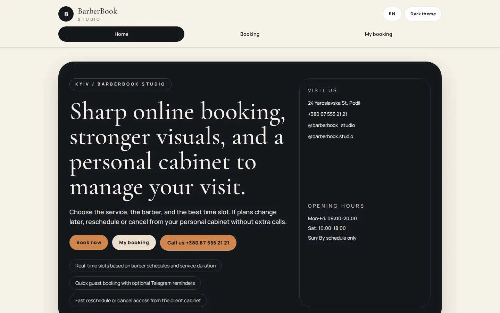
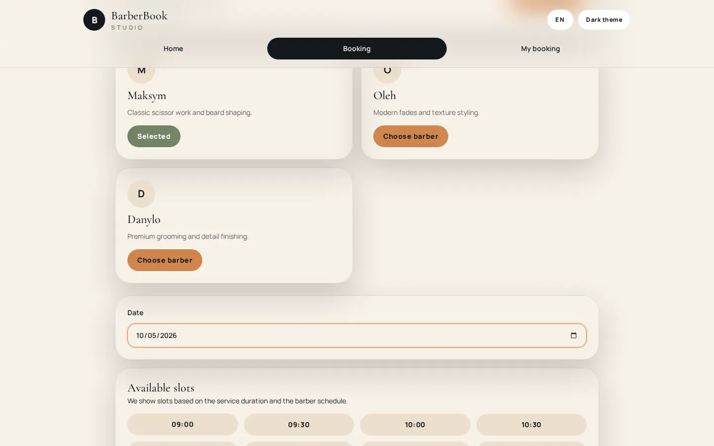
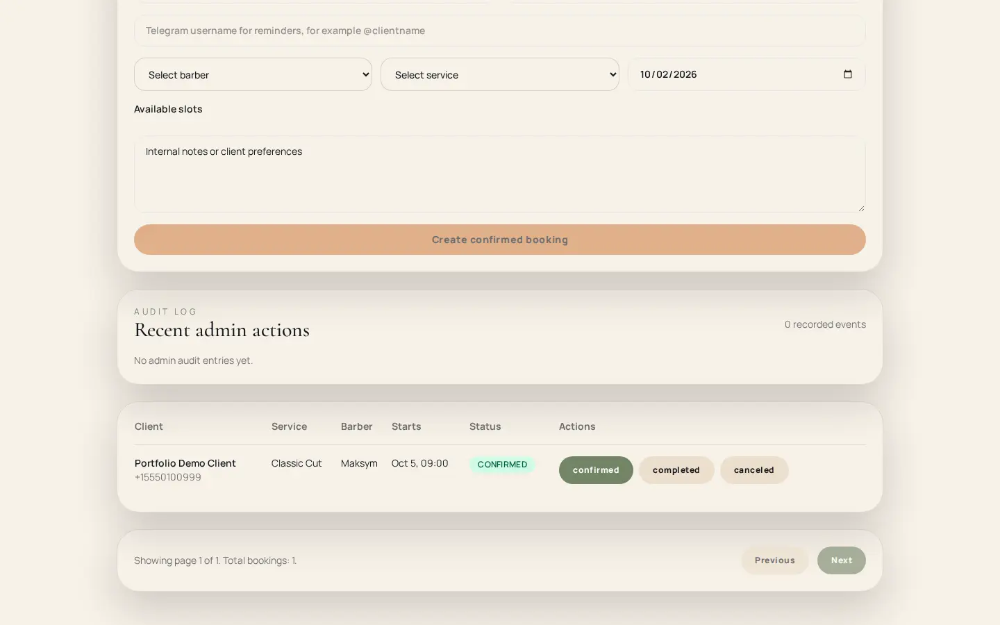
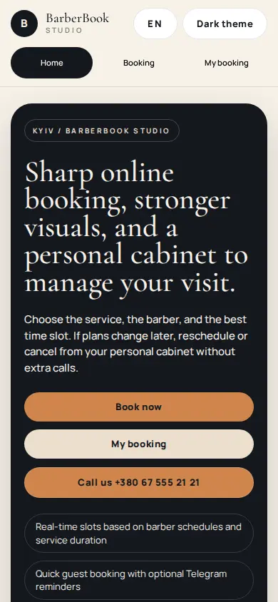
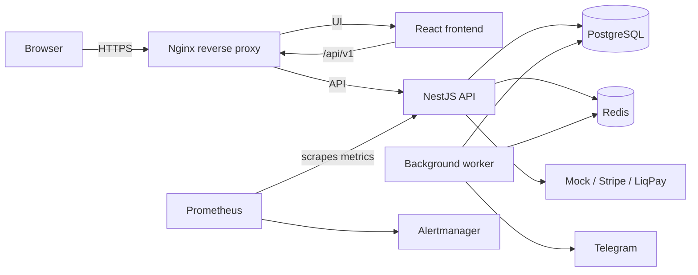

# BarberBook Studio

Production-oriented full-stack booking platform for barbershops. It covers the booking lifecycle from service selection and live availability through temporary holds, payment confirmation, and client self-service.

[](https://github.com/Rimus0cod/site/actions/workflows/ci.yml?query=branch%3Aportfolio-improvements)


[Live demo: not deployed yet](#live-demo) · [Architecture](#architecture) · [Local setup](#local-setup)

## Live demo

There is no public demo URL yet. The deployment checklist is in [docs/demo-deployment.md](docs/demo-deployment.md); the current production configuration intentionally rejects mock payments, so public demo deployment needs a reviewed payment-mode decision first.

## Preview

<p align="center">
  
  
</p>

<p align="center">
  
  
</p>

Additional real demo views are available in [docs/screenshots/](docs/screenshots/), including the confirmed booking, client portal, and dark theme. The capture process and review requirements are documented in [docs/screenshots/README.md](docs/screenshots/README.md).

## Highlights

- Conflict-safe booking workflow with expiring temporary holds
- Mock, Stripe, and LiqPay payment-provider adapters
- Client and admin authentication, plus booking management
- Rescheduling and cancellation
- Redis-backed availability and a separate background worker
- Telegram notifications and scheduled jobs
- Rate limiting and CSRF protection
- Prometheus metrics, Alertmanager configuration, and automated PostgreSQL backups
- Dockerized production deployment behind Nginx
- Real full-stack Playwright E2E against NestJS, PostgreSQL, Redis, and mock payment

## Tech stack

| Area | Technologies |
| --- | --- |
| Frontend | React 18, TypeScript, Vite, Tailwind CSS, React Router, TanStack Query, Zustand |
| Backend | NestJS 11, TypeScript, TypeORM, JWT/cookie authentication |
| Data | PostgreSQL 15, Redis 7 |
| Payments and notifications | Mock / Stripe / LiqPay adapters, Telegram Bot API |
| Operations | Docker Compose, Nginx, Prometheus, Alertmanager, PostgreSQL backup scripts |
| Validation | TypeScript checks, backend tests, Playwright, Docker Compose and image builds |

## Architecture



The full explanation is in [docs/architecture.md](docs/architecture.md).

## Quality & Testing

- Frontend TypeScript validation, lint, and production build
- Backend lint, tests, and production build
- Dependency audit
- Docker Compose configuration validation and Docker image builds
- Frontend smoke tests for route reachability and basic rendering
- Full-stack Playwright booking flow against real services

The full-stack E2E runs the actual React UI against NestJS, PostgreSQL, Redis, and `PAYMENT_PROVIDER=mock`; it verifies:

```text
service → barber → available slot → booking hold → mock payment → confirmed booking
```

The latest successful Actions run for the portfolio branch is [CI](https://github.com/Rimus0cod/site/actions/runs/36908688310).

### Run frontend smoke tests

```bash
cd frontend
npm ci
npx playwright install chromium
npm run test:e2e:smoke
```

### Run full-stack booking E2E

Requires Docker Engine/Compose, Node.js 20+, and Playwright Chromium:

```bash
cd frontend
npm ci
npx playwright install chromium
npm run test:e2e:full
```

The runner starts an isolated PostgreSQL + Redis Compose project, runs migrations and demo seed data, waits for backend/frontend readiness, runs the UI flow, then removes the containers, network, and database volume.

## Features

- Customer booking wizard at `/booking`, availability lookup, and public booking confirmation
- Client portal at `/account` for booking lookup and self-service
- Admin sign-in at `/admin/login` and protected admin pages for bookings, services, barbers, and schedules
- Short-lived holds to reserve slots while payment is in progress
- Provider-based payment confirmation and booking conversion
- Background worker for scheduled tasks, reminders, payment reconciliation, and Telegram notifications
- Liveness/readiness health checks and Prometheus metrics

## Application routes

| Route | Purpose |
| --- | --- |
| `/` | Public home page |
| `/booking` | Service, barber, date, and time selection |
| `/booking/hold/:id` | Temporary hold and payment step |
| `/booking/confirm/:id` | Confirmed booking |
| `/account` | Client booking access and self-service |
| `/admin/login` | Admin sign-in |
| `/admin` | Booking and operations dashboard |
| `/admin/barbers`, `/admin/services`, `/admin/schedule` | Manage staff, services, and schedules |

The API also exposes liveness and readiness health checks at `/health/live` and `/health/ready`; Prometheus metrics are served at `/api/v1/metrics`.

## User journeys

### Client booking

1. Select a service and barber, then choose an available date and time.
2. Create a short-lived hold for the selected slot.
3. Complete payment with the configured provider.
4. View the confirmed booking and access it later through the client portal.

Clients can also retrieve and manage eligible bookings from `/account`, including cancellation or rescheduling when the booking rules allow it.

### Admin operations

After signing in at `/admin/login`, staff can review bookings and manage barbers, services, and working schedules. Admin credentials are configured privately on the server; never publish them in this repository.

## Local setup

Prerequisites: Node.js 20+, npm, Docker Engine, and Docker Compose.

```bash
cp backend/.env.example backend/.env
# Replace the example credentials/secrets before using the local stack.
docker compose up --build
```

The development stack exposes the frontend at `http://localhost:3000` and backend API at `http://localhost:3001/api/v1`. Do not use these local credentials or `.env` values for a public deployment.

For a no-Docker frontend development server, install dependencies with `npm ci` in `frontend/` and run `npm run dev`. The backend still needs reachable PostgreSQL and Redis services.

The backend package also provides `npm run migration:run`, `npm run seed:demo`, and `npm run seed:admin` for local database setup. Run the demo seed only against an isolated development/test database; use private values for any admin account.

## Production deployment

The production Compose stack includes PostgreSQL, Redis, the API, a worker, one-off migrations, backups, static frontend, and Nginx. Public traffic is intended to enter through Nginx on ports 80/443; PostgreSQL and Redis have no published host ports in the production Compose file.

Deployment steps, required environment variables, HTTPS, health checks, payment provider configuration, and the current mock-payment restriction are described in [docs/production.md](docs/production.md) and [docs/demo-deployment.md](docs/demo-deployment.md).

### Deployment sequence

1. Create a private `.env.production` outside version control. At minimum configure `DB_NAME`, `DB_USER`, `DB_PASSWORD`, `JWT_SECRET`, `ADMIN_EMAIL`, `ADMIN_PASSWORD`, `FRONTEND_URL`, `BACKEND_PUBLIC_URL`, and `PAYMENT_PROVIDER`. Production requires HTTPS URLs, a 32+ character JWT secret, and a non-placeholder admin password.
2. Configure the credentials required by the selected payment provider. Production currently accepts Stripe or LiqPay, not mock.
3. Put TLS files at `nginx/certs/fullchain.pem` and `nginx/certs/privkey.pem`.
4. Build and migrate before starting the application:

   ```bash
   docker compose --env-file .env.production -f docker-compose.prod.yml build
   docker compose --env-file .env.production -f docker-compose.prod.yml --profile ops run --rm migrations
   docker compose --env-file .env.production -f docker-compose.prod.yml up -d
   ```

5. Check `https://your-domain/health/live` and `https://your-domain/health/ready`.

Do not publish admin demo credentials. Restrict admin access at the hosting/reverse-proxy or network layer before exposing a demo. Keep provider keys and database credentials out of frontend build variables.

## Observability and backups

Prometheus and Alertmanager are available through the `observability` Compose profile. PostgreSQL backups use `pg_dump -Fc`, retention settings, and backup freshness metadata. See [docs/observability.md](docs/observability.md) and [docs/backup-restore.md](docs/backup-restore.md).

To enable monitoring:

```bash
docker compose --env-file .env.production -f docker-compose.prod.yml --profile observability up -d prometheus alertmanager
```

The bundled Prometheus rules cover API errors/latency, PostgreSQL and Redis readiness, backup freshness, and worker lag. Configure a real Alertmanager receiver before relying on alerts. Prometheus and Alertmanager publish host ports in the supplied Compose file; firewall or otherwise restrict access to them on a public host.

Backups are scheduled through the `backup` service and stored under `ops/backups/`; freshness state is stored under `ops/backup-state/`. For an on-demand backup:

```bash
docker compose --env-file .env.production -f docker-compose.prod.yml run --rm backup sh /backup-scripts/backup-postgres.sh
```

See the linked backup/restore guide for restore procedure and recovery checks.

## Repository layout

```text
backend/        NestJS API, migrations, seed scripts, and worker
frontend/       React customer and admin application
nginx/          Production reverse proxy
monitoring/     Prometheus and Alertmanager configuration
ops/            Backup and restore scripts
docs/           Architecture, deployment, and screenshot guidance
```

## Further documentation

- [Architecture](docs/architecture.md)
- [Demo deployment checklist](docs/demo-deployment.md)
- [Production deployment](docs/production.md)
- [Observability](docs/observability.md)
- [Backup and restore](docs/backup-restore.md)
- [Screenshot capture requirements](docs/screenshots/README.md)
- [GitHub repository presentation](docs/github-portfolio-setup.md)

---

## Developer commands

Frontend: `npm run lint`, `npm run build`, `npm run test:e2e:smoke`, `npm run test:e2e:full`.

Backend: `npm run lint`, `npm run test`, `npm run build`, `npm run migration:run`, `npm run seed:demo`, `npm run seed:admin`.

## Payment provider environment

For Stripe, configure the backend with:

```env
PAYMENT_PROVIDER=stripe
STRIPE_SECRET_KEY=<secret>
STRIPE_WEBHOOK_SECRET=<webhook secret>
STRIPE_PUBLISHABLE_KEY=<publishable key>
```

For LiqPay:

```env
PAYMENT_PROVIDER=liqpay
LIQPAY_PUBLIC_KEY=<public key>
LIQPAY_PRIVATE_KEY=<private key>
LIQPAY_SANDBOX=true
```

Never commit provider credentials. Production environment validation requires a real supported provider; mock payments are intended for local and isolated E2E environments.
