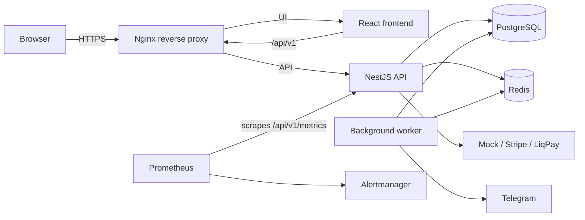

# Architecture overview

BarberBook Studio is structured as a production-oriented full-stack booking platform with a single application shell and a small set of operational services.

## Request and service topology

The frontend provides the customer and admin experiences. Nginx is the single public entry point: it serves the React application and proxies API requests to NestJS. PostgreSQL is the durable source of truth; Redis supports availability caching, invalidation, and worker coordination.

## Why Redis is used

Redis is used for fast availability checks and cache invalidation. Booking calendars are time-sensitive, and slot availability changes frequently when a user creates or confirms a hold. Redis reduces repeated database reads and accelerates the slot search experience without changing the core booking source of truth in PostgreSQL.

## Why a separate worker exists

The worker process owns background tasks that should not block the user-facing API, including Telegram notifications, reminders, hold expiration, and payment reconciliation. It shares PostgreSQL and Redis with the API but runs as a distinct Compose service.

## Booking hold lifecycle

1. A client selects a service, barber, and slot.
2. The backend reserves a temporary booking hold for a short TTL window.
3. The hold is tied to an access token and a payment requirement.
4. The user completes payment or chooses a mock payment flow.
5. The system converts the hold into a confirmed booking and invalidates slot cache entries.

This pattern prevents double-booking while keeping the booking process user-friendly.

## Conflict prevention

The core database logic avoids overlapping bookings by checking both active bookings and active holds for the same barber and time range. It also enforces per-phone limits to reduce abuse and duplicate reservations.

## Payment confirmation flow

The application supports mock, Stripe, and LiqPay providers. Mock payment is used by the isolated E2E environment; production configuration deliberately rejects `PAYMENT_PROVIDER=mock`. A selected provider creates a checkout/payment record, and successful payment confirms the hold before converting it into a booking.

## Health checks and monitoring

The backend exposes liveness and readiness endpoints, and the stack includes Prometheus plus Alertmanager for monitoring and alerting. Production Nginx proxies `/health/live` and `/health/ready`; Prometheus scrapes `/api/v1/metrics`.

## Backup process

The production compose stack includes backup automation for PostgreSQL. Operational artifacts are stored under `ops/` and can be reviewed for backup freshness and retention policies.

## Summary

The project is intentionally kept simple but production-minded: a modern frontend, a robust API layer, a relational database as the source of truth, Redis for time-critical availability, worker-based async processing, and standard operational tooling for deployment and debugging.
